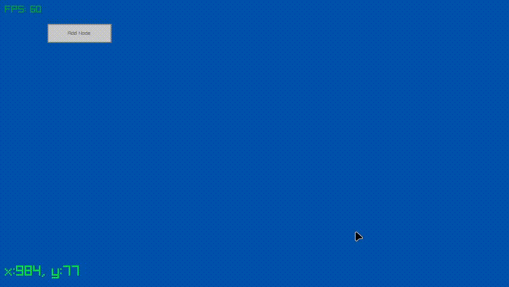

# Simple animation of priority Queue (min heap)

# Plan
- add animation for deleting a node
- incorporate huffman encoding
- improve ui and support keyboard
# Installation
first we need zig, you can find it on
[ziglang](https://ziglang.org/). Second we need raylib, a graphics library:
1. `zig fetch --save=raylib
   https://github.com/raysan5/raylib/archive/<hash>.tar.gz` and
   replace with appropriate hash
2. add the following to `build.zig`:
``` zig
const raylib_dep = b.dependency("raylib", .{
    .target = target,
    .optimize = optimize,
});
exe.linkLibrary(raylib_dep.artifact("raylib"));
```

